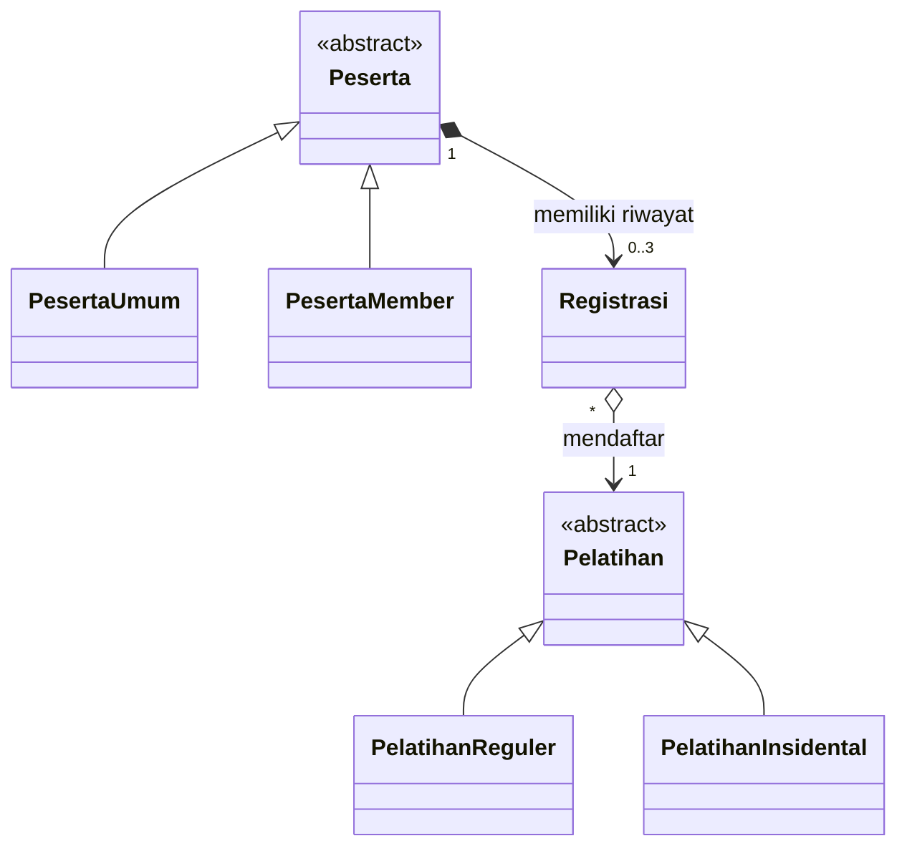

## Nomor 1



## Nomor 2

1. Peserta - PesertaUmum: Inheritance, kelas PesertaUmum mewarisi semua atribut dan method non-privat dari kelas Peserta
2. Peserta - PesertaMember: Inheritance, kelas PesertaMember mewarisi semua atribut dan method non-privat dari kelas Peserta
3. Peserta - Registrasi:
    - Composition, kelas Registrasi berkomposit ke kelas Peserta, sehingga kalau kelas Peserta hilang, maka kelas Registrasi juga akan ikut hilang.
    - Association, kelas Peserta memanggil data dari kelas Registrasi untuk menampilkan informasinya
4. Registrasi - Pelatihan:
    - Aggregation, kelas Registrasi itu bisa berdiri secara independen, yang mana kalau kelas Registrasi dihapus, kelas Pelatihan tidak akan berpengaruh, begitu pula sebaliknya
    - Association, kelas Registrasi akan menyimpan data kelas Pelatihan di dalamnya
5. Pelatihan - PelatihanReguler: Inheritance, kelas PelatihanReguler dapat mewarisi semua atribut dan method non-privat dari kelas Pelatihan
6. Pelatihan - PelatihanInsidental: Inheritance, kelas PelatihanInsidental dapat mewarisi semua atribut dan method non-privat dari kelas Pelatihan

## Nomor 3


## Nomor 4

Ada, yaitu pajak dan diskon. Pajak itu dikarenakan nilanya sama untuk setiap jenis pelatihan, dan bisa berubah sewaktu-waktu. Sedangkan diskon dikarenakan nilainya bisa berubah-ubah juga, walaupun tiap jenis peserta bisa berbeda diskonnya.

## Nomor 5

```java
package classDiagram;

import java.time.LocalDate;

public abstract class Pelatihan {
    private String kode;
    private String nama;
    private int kuota;
    private String namaInstruktur;
    private double harga;
    private static double pajak;

    protected Pelatihan(String kode, String nama, int kuota, String namaInstruktur, double harga) {
        this.kode = kode;
        this.nama = nama;
        this.kuota = kuota;
        this.namaInstruktur = namaInstruktur;
        this.harga = harga;
    }

    public void tampilkanDetail() {
        System.out.println("Kode             : " + getKode());
        System.out.println("Nama             : " + getNama());
        System.out.println("Kuota            : " + getKuota());
        System.out.println("Nama Instruktur  : " + getNamaInstruktur());
        System.out.println("Harga            : " + getHarga());
        System.out.println("Pajak            : " + Pelatihan.getPajak());
    }
}

public class PelatihanReguler extends Pelatihan {
    private int durasiBulan;
    private String level;
    private String metode;

    public PelatihanReguler(
            String kode,
            String nama,
            int kuota,
            String namaInstruktur,
            double harga,
            int durasiBulan,
            String level,
            String metode
    ) {
        super(kode, nama, kuota, namaInstruktur, harga);
        this.durasiBulan = durasiBulan;
        this.level = level;
        this.metode = metode;
    }

    @Override
    public void tampilkanDetail() {
        System.out.println("=== Detail Pelatihan Reguler ===");
        super.tampilkanDetail();
        System.out.println("Durasi Bulan     : " + getDurasiBulan());
        System.out.println("Level            : " + getLevel());
        System.out.println("Metode           : " + getMetode());
    }
}

public class PelatihanInsidental extends Pelatihan {
    private LocalDate tanggal;
    private String metode;

    public PelatihanInsidental(
            String kode,
            String nama,
            int kuota,
            String namaInstruktur,
            double harga,
            LocalDate tanggal,
            String metode
    ) {
        super(kode, nama, kuota, namaInstruktur, harga);
        this.tanggal = tanggal;
        this.metode = metode;
    }

    @Override
    public void tampilkanDetail() {
        System.out.println("=== Detail Pelatihan Insidental ===");
        super.tampilkanDetail();
        System.out.println("Tanggal          : " + getTanggal());
        System.out.println("Metode           : " + getMetode());
    }
}

public abstract class Peserta {
    private String noKTP;
    private String nama;
    private String email;
    private Registrasi[] riwayatRegistrasi;
    private int jumlahRegistrasi;

    protected Peserta(String noKTP, String nama, String email) {
        this.noKTP = noKTP;
        this.nama = nama;
        this.email = email;
        this.riwayatRegistrasi = new Registrasi[3];
        this.jumlahRegistrasi = 0;
    }

    public abstract double getDiskon();

    public void daftarPelatihan(Registrasi reg) {
        if (jumlahRegistrasi < 3) {
            riwayatRegistrasi[jumlahRegistrasi] = reg;
            jumlahRegistrasi++;
            System.out.println(
                    "Registrasi berhasil ditambahkan untuk peserta: "
                            + getNama()
            );
        } else {
            System.out.println(
                    "Gagal mendaftar: Peserta "
                            + getNama()
                            + " telah mencapai batas maksimal 3 pelatihan."
            );
        }
    }

    public void printInfo() {
        System.out.println("No KTP           : " + getNoKTP());
        System.out.println("Nama             : " + getNama());
        System.out.println("Email            : " + getEmail());
        System.out.println("Jumlah Registrasi: " + jumlahRegistrasi + "/3");
    }
}

public class PesertaUmum extends Peserta {
    public PesertaUmum(String noKTP, String nama, String email) {
        super(noKTP, nama, email);
    }

    @Override
    public double getDiskon() {
        return 0.0;
    }

    @Override
    public void printInfo() {
        System.out.println("=== Info Peserta Umum ===");
        super.printInfo();
        System.out.println("Jenis Peserta     : Umum");
        System.out.println("Diskon            : " + getDiskon());
    }
}

public class PesertaMember extends Peserta {
    private String noAnggota;
    private LocalDate tanggalGabung;
    private static double diskon;

    public PesertaMember(
            String noKTP,
            String nama,
            String email,
            String noAnggota,
            LocalDate tanggalGabung
    ) {
        super(noKTP, nama, email);
        this.noAnggota = noAnggota;
        this.tanggalGabung = tanggalGabung;
    }

    @Override
    public double getDiskon() {
        return diskon;
    }

    @Override
    public void printInfo() {
        System.out.println("=== Info Peserta Member ===");
        super.printInfo();
        System.out.println("No Anggota        : " + getNoAnggota());
        System.out.println("Tanggal Gabung    : " + getTanggalGabung());
        System.out.println("Diskon            : " + getDiskon());
    }
}

public class Registrasi {
    private LocalDate tanggalRegistrasi;
    private LocalDate tanggalBayar;
    private String metodePembayaran;
    private Pelatihan pelatihan;

    public Registrasi(
            LocalDate tanggalRegistrasi,
            LocalDate tanggalBayar,
            String metodePembayaran
    ) {
        this.tanggalRegistrasi = tanggalRegistrasi;
        this.tanggalBayar = tanggalBayar;
        this.metodePembayaran = metodePembayaran;
    }

    public Registrasi(
            LocalDate tanggalRegistrasi,
            LocalDate tanggalBayar,
            String metodePembayaran,
            Pelatihan pelatihan
    ) {
        this(tanggalRegistrasi, tanggalBayar, metodePembayaran);
        this.pelatihan = pelatihan;
    }

    public double hitungHargaAkhir(double diskonPeserta) {
        if (pelatihan == null) {
                throw new IllegalStateException(
                    "Pelatihan belum dihubungkan ke objek Registrasi."
                );
        }

        double hargaDasar = pelatihan.getHarga();
            double totalDenganPajak =
                hargaDasar + (hargaDasar * Pelatihan.getPajak());
            double totalAkhir =
                totalDenganPajak - (totalDenganPajak * diskonPeserta);

        return Math.max(totalAkhir, 0.0);
    }

    public void tampilkanInfoPembayaran() {
        System.out.println("=== Info Pembayaran Registrasi ===");
        System.out.println("Tanggal Registrasi: " + getTanggalRegistrasi());
        System.out.println("Tanggal Bayar     : " + getTanggalBayar());
        System.out.println("Metode Pembayaran : " + getMetodePembayaran());

        if (pelatihan != null) {
            System.out.println(
                    "Pelatihan         : "
                            + pelatihan.getNama()
                            + " ("
                            + pelatihan.getKode()
                            + ")"
            );
        } else {
            System.out.println("Pelatihan         : belum ditentukan");
        }
    }
}
```

## Nomor 6

Konsep enkapsulasi diterapkan pada atribut dan method yang ada di class. Untuk overloading itu ada di konstruktor Registrasi, yang mana ada yang dengan parameter Pelatihan dan tanpa parameter Pelatihan. Untuk overriding method tampilkanDetail atau printInfo, di parentnya sudah diimplementasikan, namun di childnya juga dioverride untuk ditambahkan lagi informasi yang diprint.
